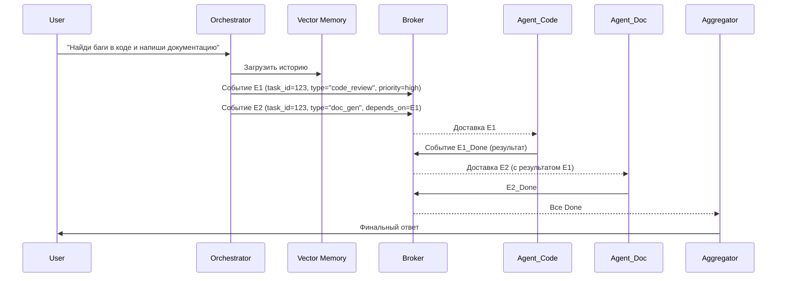

# Agentic Mesh: Event-Driven Multi-Agent архитектура

> **Ключевое отличие от MoE:** модели — это самостоятельные микросервисы (разные фреймворки, разные GPU, разные репозитории). Связь — через асинхронные события (брокер). Диспетчер — это State Machine.

См. также: [[Mixture of Experts и Multi-Agent Systems]], [[Оптимизация производительности Agentic Mesh]]

> **Референс-идеи:** частично опираемся на паттерны из
> [OpenAgentMesh (OAM)](https://github.com/openagentmesh/openagentmesh) —
> агенты-как-функции, two-tier discovery (каталог + JSON-schema), NATS как
> единственная инфра-зависимость (KV + Object Store), queue-group scaling.
> У нас вместо плоской peer-to-peer модели — центральный Orchestrator,
> LLM-Planner и DAG с зависимостями, а фасад — OpenAI-совместимый API.

## 0. Vision — OpenAI-совместимый фасад

Цель — фреймворк, который по **стандартному OpenAI API** (`POST /v1/chat/completions`,
формат ответа и `usage` как у OpenAI) принимает запрос, разбивает его на
логические части, отправляет на исполнение **узкоспециализированным моделям**
через брокер, исполняет и возвращает пользователю собранный результат.

```
Клиент (любой OpenAI-SDK)
   │  POST /v1/chat/completions
   ▼
Ingress Gateway  ──  эмулирует OpenAI API (токены, формат, SSE)
   │  (внутри: Orchestrator)
   ├─ Planner: LLM-декомпозиция запроса в DAG
   ├─ NATS JetStream: tasks.* → узкоспециализированные модели
   ├─ Finalizer: сбор + merge результатов
   ▼
Ответ в формате OpenAI клиенту
```

OpenAI-формат — только обёртка на входе/выходе; ядро оперирует внутренними
`Plan`/`Task` (см. раздел 4). Брокер, vector memory и живучесть — на NATS
JetStream + KV (см. ROADMAP). Открытые вопросы, влияющие на Finalizer/Gateway:

- **Streaming:** SSE-поток как у OpenAI или только финальный ответ после сборки DAG?
- **Прозрачность моделей:** клиент видит одну модель `agentic-mesh` (роутинг скрыт)
  или сам выбирает саб-модели?
- **Прямой прокси:** ✅ решено — нужен. Простые запросы идут на default-модель без декомпозиции (см. ROADMAP Phase 6).

## 1. Базовый компонентный состав

| Компонент                     | Роль                                                                                                                                                   | Технологии                                                                   |
| :---------------------------- | :----------------------------------------------------------------------------------------------------------------------------------------------------- | :--------------------------------------------------------------------------- |
| **Ingress Gateway**           | Принимает HTTP/WS запрос от пользователя, валидирует токены.                                                                                           | FastAPI / Nginx                                                              |
| **Orchestrator (Brain)**      | Анализирует интент, строит DAG (граф зависимостей задач), эмиттит события.                                                                             | Python + FastStream (NATS) + LangGraph / Temporal                            |
| **Message Broker**            | Шина событий на NATS JetStream. Гарантирует доставку (streams), хранит очереди, KV для state/idempotency, **Object Store** для артефактов mid-размера. | NATS JetStream (streams + KV + Object Store), FastStream как клиент          |
| **StoreService (абстракция)** | Put/get артефактов; агенты знают только `result_ref`, не реализацию.                                                                                   | NATS Object Store (≤ сотен МБ, транзитное) / MinIO·S3 (>1 ГБ, персистентное) |
| **Vector Memory**             | Хранит эмбеддинги контекста диалога. Доступна всем агентам.                                                                                            | Qdrant / Milvus                                                              |
| **Agent Pool**                | Набор изолированных раннеров. Каждый слушает свою очередь (NATS consumer group).                                                                       | Docker + FastStream + Transformers                                           |
| **Orchestrator Finalizer**    | Подписан на `results.*`, собирает ответы, разрешает коллизии, таймаутит, финализирует агрегацию.                                                       | NATS JetStream (consumer)                                                    |

## 2. Декомпозиция и выбор модели

Два независимых вопроса: (а) как разбить запрос на части и (б) какую модель назначить каждой части.

### 2.1 Декомпозиция (LLM-планировщик)

Запрос разбивает LLM-планировщик (Phase 1) в DAG типизированных подзадач. Вывод жёстко схемизирован (pydantic / JSON-schema): у каждой задачи — ограниченный `type` и `depends_on`. Битый JSON, циклы и висячие зависимости ловятся валидацией до отправки в шину (это и есть риск Phase 1).

### 2.2 Выбор модели (capability registry / catalog)

Планировщик эмитит семантический `task_type`, а конкретная модель резолвится через **registry способностей** — конфигурационная форма того же каталога, что и §2.3-Вариант A. Единый источник правды (регистрируемые/статичные записи):

```yaml
# capabilities.yaml
code_review: { model: "microsoft/CodeGPT-small-py", gpu: "a10" }
doc_gen: { model: "Qwen2.5-Coder-7B", gpu: "a10" }
translate: { model: "Helsinki-NLP/opus-mt", gpu: "cpu" }
```

Тот же `type` шлётся в NATS как subject (`tasks.code_review`). Менять модель можно без правки планировщика.

### 2.3 Динамический роутинг (опционально)

Если тип неоднозначен, вместо захардкоженного `type`:

**Вариант A — Catalog-driven (основной, рекомендован):** держим компактный **Agent Catalog** (описание + способности + channel/tags, ~20–30 токенов на агента), пригодный для прямого чтения LLM. Планировщик/Router выбирает агента из каталога, а полный JSON-schema нужного агента подтягивается только после выбора. Это дешевле hardcoded-registry и точнее классификатора — идея подсмотрена у [OpenAgentMesh (OAM)](https://github.com/openagentmesh/openagentmesh). Каталог обновляется автоматически при регистрации агента в NATS.

```python
catalog = await mesh.catalog(channel="finance.risk")   # ~20-30 токенов на агента
contract = await mesh.contract("summarizer")           # полный JSON-schema только выбранного
```

**Вариант B — Embedding + cosine similarity (zero-shot):** вектор подзадачи → ближайший вектор способности модели из registry. Без обучения, правится YAML. Для 3–10 классов — оптимально.

- **Маленький трансформер** (DistilBERT / ruBERT-tiny) — если нужен обучаемый классификатор: точнее CNN на тексте, работает на CPU.
- **CNN не используем:** требует размеченных данных, на коротких подзадачах избыточна, на русском проигрывает трансформеру.
- **DVC не используем:** это версионирование датасетов/моделей и batch-пайплайны в CI, к рантайм-роутингу отношения не имеет (разве что трекинг весов агентов в MLOps).

**Fallback-стратегия (Router обязан всегда вернуть ответ):** если не нашли модель (`UnknownTaskTypeError` / `LowConfidenceError`) — логируем в отдельный поток для ручного анализа и шлём на default-модель (GPT-4o-mini / Mistral, `confidence=0`). Так система не падает на незнакомом типе.

```python
class FallbackRouter(BaseRouter):
    async def route(self, inp: RouterInput) -> RouterOutput:
        try:
            return await self.primary_router.route(inp)
        except (UnknownTaskTypeError, LowConfidenceError):
            await log_unknown_task(inp)
            return RouterOutput(model_name="default-fallback-model",
                                gpu_type="cpu", confidence=0.0)
```

## 3. Схема потока данных (Event-Driven)



## 4. Сквозной код оркестратора (FastStream + NATS JetStream)

**Компоненты внутри Orchestrator (из ROADMAP Phase 3):** независимые модули
`Planner → Router → Dispatcher → Finalizer`. Здесь для краткости `WorkflowDAG`
выполняет роль Planner+Finalizer; в продакшене они разнесены.

Транспортный слой — **FastStream** (NATS/JetStream): декларативные
`@broker.subscriber`/`@broker.publisher` и Pydantic-схемы сообщений.
Доменная логика (`WorkflowDAG`, Planner) намеренно **независима от брокера** —
её можно двигать и тестировать без NATS.

**Схема subjects (иерархическая, масштабируется):**

```
tasks.{type}.{priority}        # tasks.code_review.high
results.{type}.{task_id}       # results.code_review.abc123
dead_letter.{type}             # упавшие после всех retry
control.commands.{orchestrator_id}  # стоп/пауза
```

Приоритеты: `high` → быстрые модели, `low` → ночные батчи; позволяет
мониторить очередь по типу и подписываться на конкретный `task_id` для отладки.

**Артефакты — через StoreService, не в JSON.** Результаты моделей
(текст/файлы/эмбеддинги) могут превышать лимит ~1MB сообщения JetStream,
поэтому по шине ходит только ссылка `{ "result_ref": "bucket/task123/out" }`,
а сам артефакт кладётся через `StoreService`.

**Правило разбиения хранилища:**

- **≤ сотен МБ, живёт в течение запроса** → NATS Object Store (встроен, без отдельного сервиса).
- **> 1 ГБ / персистентное / отдаётся наружу** (presigned-URL) → MinIO/S3/R2.

Абстракция `StoreService.put()/get()` → `result_ref` скрывает реализацию от агентов;
границу можно перенести с NATS-OS на MinIO/S3 без правки кода — тот же подход, что с брокером.

```python
from enum import Enum
from faststream import FastStream
from faststream.nats import NatsBroker
from pydantic import BaseModel

broker = NatsBroker("nats://localhost:4222")
app = FastStream(broker)

# --- доменная логика (framework-agnostic) ---
class TaskType(str, Enum):
    CODE_REVIEW = "code_review"
    DOC_GEN = "doc_gen"
    TRANSLATE = "translate"

class WorkflowDAG:
    """Хранит граф зависимостей для конкретного запроса"""
    def __init__(self, task_id):
        self.task_id = task_id
        self.graph = {
            "code_review": {"depends": [], "status": "pending", "result": None},
            "doc_gen": {"depends": ["code_review"], "status": "pending", "result": None}
        }

    def is_ready(self, task_type):
        return all(self.graph[d]["status"] == "done"
                   for d in self.graph[task_type]["depends"])

state_storage = {}

# --- контракты сообщений ---
class TaskMsg(BaseModel):
    task_id: str
    type: str
    prompt: str | None = None
    parent_result: str | None = None

class ResultMsg(BaseModel):
    task_id: str
    type: str
    result: str

# вход от Gateway (FastAPI) — старт workflow
@broker.subscriber("requests")
async def on_request(msg: TaskMsg):
    dag = WorkflowDAG(msg.task_id)
    state_storage[msg.task_id] = dag
    for t, data in dag.graph.items():
        if not data["depends"]:
            await broker.publish(
                TaskMsg(task_id=msg.task_id, type=t, prompt=msg.prompt),
                subject=f"tasks.{t}",
            )
            data["status"] = "processing"

# сбор результатов и запуск зависимых задач
@broker.subscriber("results.*")
async def on_result(msg: ResultMsg):
    dag = state_storage[msg.task_id]
    dag.graph[msg.type]["status"] = "done"
    dag.graph[msg.type]["result"] = msg.result
    for nxt, props in dag.graph.items():
        if props["status"] == "pending" and dag.is_ready(nxt):
            parent = dag.graph[props["depends"][0]]["result"]
            await broker.publish(
                TaskMsg(task_id=msg.task_id, type=nxt, parent_result=parent),
                subject=f"tasks.{nxt}",
            )
            props["status"] = "processing"
    if all(i["status"] == "done" for i in dag.graph.values()):
        await finalize_aggregation(msg.task_id)
```

## 5. Код типового агента (очередь → GPU → ответ)

Агент слушает **свою** очередь через FastStream, ничего не знает о других агентах. Шаблон один — меняется только загрузка модели и вызов инференса.

```python
import torch
from transformers import AutoModelForCausalLM
from faststream import FastStream
from faststream.nats import NatsBroker
from pydantic import BaseModel

broker = NatsBroker("nats://orchestrator:4222")
app = FastStream(broker)

model = AutoModelForCausalLM.from_pretrained("microsoft/CodeGPT-small-py")
model.eval()

class TaskMsg(BaseModel):
    task_id: str
    type: str
    prompt: str | None = None
    parent_result: str | None = None

class ResultMsg(BaseModel):
    task_id: str
    type: str
    result: str

@broker.subscriber("tasks.code_review")
async def handle(msg: TaskMsg):
    result = model.generate(msg.prompt)
    await broker.publish(
        ResultMsg(task_id=msg.task_id, type=msg.type, result=result),
        subject="results.code_review",
    )
```

## 6. Критические design patterns

- **Dead Letter Queue (DLQ):** при падении/зависании агента сообщение по `TTL` уходит в DLQ JetStream. Оркестратор слушает DLQ и шлёт задачу в `fallback-agent` (упрощённая модель). Без этого система рухнет при ошибке GPU. _В FastStream DLQ/retry настраиваются декларативно (`retry`, `dead_letter_topic`) на подписчике — самописный код не нужен._
- **Idempotency Keys:** из-за сетевых задержек агент может получить событие дважды. Проверять `task_id + type` в **NATS KV**; если уже обрабатывалось — отдать старый результат без вызова GPU. _Удобно оформить как FastStream middleware._

```python
class IdempotencyMiddleware:
    def __init__(self, kv: JetStreamContext.KeyValue):
        self.kv = kv
    async def is_processed(self, task_id: str, task_type: str) -> bool:
        key = f"{task_id}.{task_type}"
        try:
            await self.kv.get(key)
            return True   # уже обработано
        except KeyNotFoundError:
            await self.kv.put(key, "processing", ttl=3600)
            return False
```

- **Checkpointing (State Snapshots):** при падении оркестратора `state_storage` теряется. Писать каждое изменение статуса в **NATS KV с TTL 1 час**; при перезапуске восстанавливать активные `task_id`.

```python
class WorkflowState:
    def __init__(self, kv: JetStreamContext.KeyValue):
        self.kv = kv
    async def set_task_status(self, task_id: str, task_type: str, status: str):
        await self.kv.put(f"{task_id}.{task_type}", status)
    async def get_task_status(self, task_id: str, task_type: str) -> str:
        entry = await self.kv.get(f"{task_id}.{task_type}")
        return entry.value.decode()
```

- **Circuit Breaker:** если агент падает 5 раз подряд — оркестратор отключает его очередь на 5 минут (Retry with Exponential Backoff).
